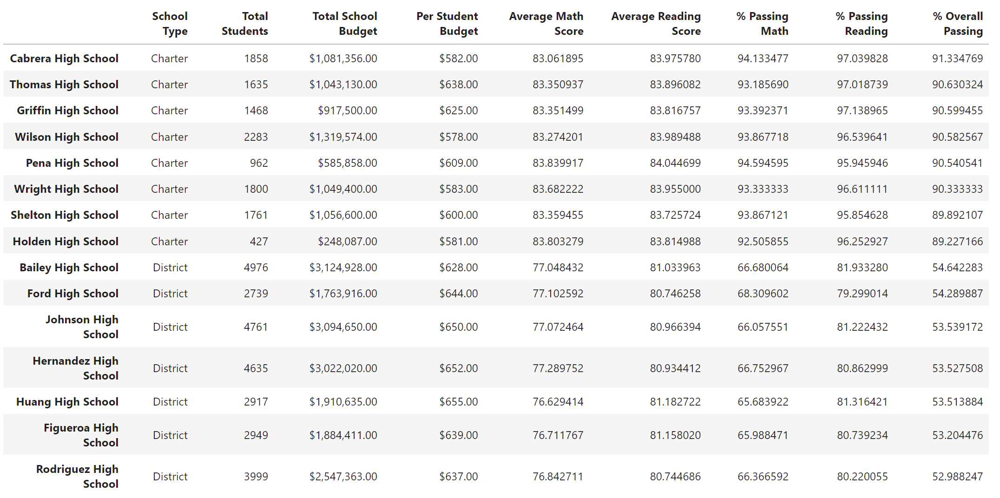
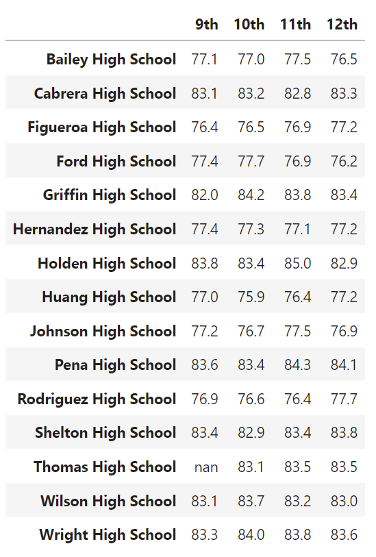
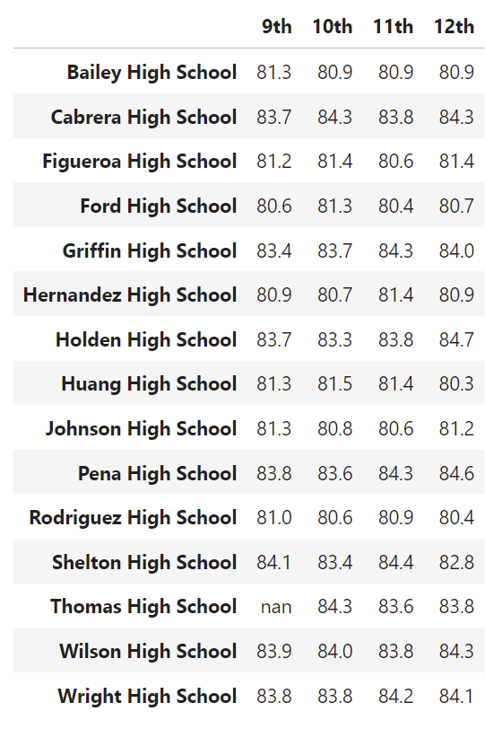
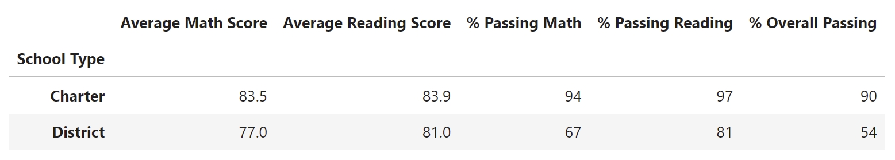

# PyCity School District Analysis

## Purpose

For this project, were given 2 data sets: one containg student performance by grade by school and another containing budgets by school.  The objective was to aggregate the data and evaluate possible trends in student performance by spending, school size and school type. This analysis will help inform the school board as they prepare budgets for the following school year. 

After this initial analysis was completed, it was determined that the reading and math scores for 9th graders at Thomas High School (THS) were compromised and should be nullified.  Following this, the analysis was repeated.  The results below reflect calculations based on this revised data set.

## Resources

- Data Sources : [schools_complete.csv](https://github.com/lnshewmo/School_District_Analysis/blob/main/Resources/schools_complete.csv), [students_complete.csv](https://github.com/lnshewmo/School_District_Analysis/blob/main/Resources/students_complete.csv)
- Software: Python 3.9.12, JupyterLab

## Results

The completed script for the analysis is available **[here](https://github.com/lnshewmo/School_District_Analysis/blob/main/PyCitySchools_Challenge.ipynb).**

### District Summary

Initial District Summary

Revised District Summary

Removing the figures from the THS 9th graders did not significantly impact the overall district summary.  
This is not surprising because there are only 461 9th graders at THS out of a total district population of 39,170 students.

### School Summary

The school summary did not change with the exception of THS percentages.

This table shows the school summary after the 9th grade THS data was replaced with `Nan`s.
It has been sorted in decending order of total students to further illustrate the the correlation between school size and type.

Replacing the THS 9th grade scores with NaN falsely pulled the passing percentages down because the calculations were not accurately reflecting the selected student population at this point.  The analysis for THS would have to be performed outside this set on just the 10-12th grade students.  

### Thomas High School Reanalysis

To correct the school summary table for THS passing percentages, new calculations were completed based on only the remaining 1174 10-12th grade students.  The new passing percentages were added back to the school summary table using `.loc` statements.  This table shows the complete school summary after revision of the THS percentages.  It is sorted in decending order of % Overall Passing to further illustrate high and low performing schools.  

The remaining tables show relationships with the revised data.

**Math Scores by Grade**            |  **Reading Scores by Grade**
:----------------------------------:|:---------------------------------:
  |  

**Scores by School Spending**

**Scores by School Size**

**Scores by School Type**

## Summary

-  Increased spending did not appear to correspond to an improvement in average scores and for this data set, shows a negative correlation with passing percentages.

-  Smaller school size also correlates with higher average scores and passing percentages.
  
-  Charter schools have only slightly higher average test scores, but show stronger passing percentages over District schools.  Reviewing the School Summary table above, Charter schools also correspond to smaller student populations (refer to the first school summary table).  

-  The 9th grade THS student population is a small subset of the whole district and removing that data did not create significant changes (less than 1% change) in any of the subsequent data summaries.  THS also retained it's ranking as the number 2 school in overall passing percentage (refer to the second school summary table).
